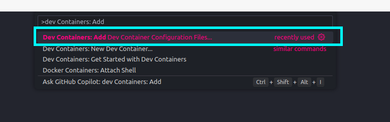
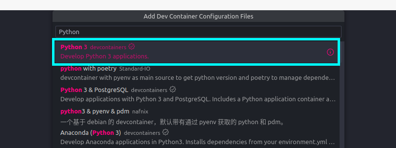
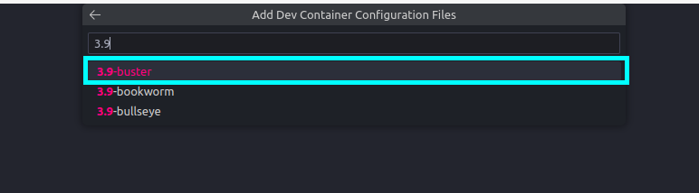
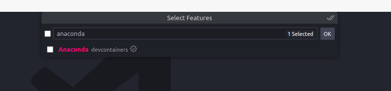
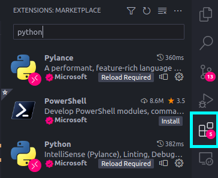
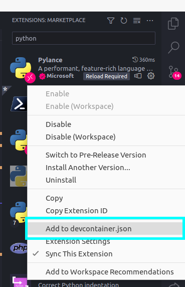
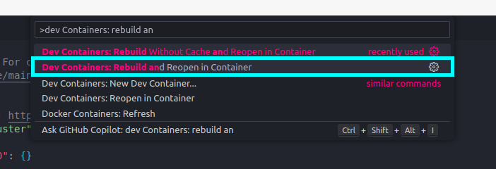

# 🚀 Creating a Python Project for ML

In this article we will create a Python project for machine learning. We will use the following tools:

- 🌹 [Poetry](https://python-poetry.org/): Dependency manager.
- 🐋 [Devcontainers](https://code.visualstudio.com/docs/remote/containers): Development environment.
- 💻 [Visual Studio Code](https://code.visualstudio.com/): IDE.

!!! info "Requirements"
    In order to follow this tutorial, you will **need** to have the following tools **installed**:

    - [Docker](https://docs.docker.com/get-docker/)
    - [Visual Studio Code](https://code.visualstudio.com/)

??? tip "Why Poetry?"

    **Poetry** is an essential tool for Python developers as it **revolutionizes dependency management**, packaging, and project development. It simplifies the process of managing project dependencies by providing a declarative and intuitive approach. With Poetry, developers can easily **define and track their project's dependencies**, ensuring consistent and reproducible development environments across different machines. Additionally, Poetry simplifies packaging by automating the **creation of distributable packages**, making it easier to share and distribute projects with others. It also facilitates the creation of virtual environments, isolating project dependencies and avoiding conflicts. Poetry's comprehensive features, combined with its user-friendly interface, streamline the development workflow and enhance the overall efficiency and maintainability of Python projects.

    !!! info "More About Poetry"
        You can find more info about Poetry in the [official documentation](https://python-poetry.org/).

??? tip "Why Devcontainers?"

    **DevContainers** offer significant benefits in the world of software development by **simplifying and standardizing development environments**. They eliminate the hassle of setting up and configuring development environments on different machines, ensuring consistency across team members. With DevContainers, developers can define a containerized environment that includes all the necessary tools, libraries, and configurations for a project. This means that everyone working on the project can use the same development environment, reducing compatibility issues and improving collaboration. DevContainers also enable seamless onboarding for new team members, as they can quickly set up the required environment without manual setup steps. Moreover, DevContainers provide isolation and security by **running the development environment within a container**, preventing conflicts with the host machine and ensuring the project's dependencies are contained. Overall, DevContainers simplify development workflows, enhance portability, and improve the overall efficiency and consistency of software projects.

    !!! info "More About Devcontainers"
        You can find more info about Devcontainers in this [official tutorial](https://code.visualstudio.com/docs/devcontainers/tutorial).

??? tip "Why Visual Studio Code?"

    **Visual Studio Code** (VS Code) holds immense significance in the field of software development due to its remarkable features and capabilities. As a powerful and extensible **code editor**, VS Code offers a seamless and customizable development experience. It supports a wide range of programming languages and frameworks, providing developers with a versatile environment for their projects. VS Code boasts an **extensive collection of extensions**, enabling developers to enhance their workflow with additional tools, integrations, and functionalities. Its intuitive interface and smart code editing features, such as IntelliSense and debugging support, boost productivity and efficiency. Moreover, VS Code's integrated terminal, version control integration, and collaboration tools make it a comprehensive solution for software development. Its cross-platform compatibility ensures a consistent experience across different operating systems. With its flexibility, extensibility, and an active community of users, Visual Studio Code has become an indispensable tool for developers worldwide.

    !!! info "More About Visual Studio Code"
        You can find more info about Visual Studio Code in the [official documentation](https://code.visualstudio.com/docs).

    !!! tip "Note"
        Visual Studio Code has an integrated AI assistant called **Copilot**. It leverages the power of AI to provide intelligent code suggestions and completions. Copilot can be used to generate code snippets, functions, and even entire classes. It can also be used to generate comments and documentation. Copilot is currently in technical preview and is available as a VS Code extension. You can find more info about Copilot in this [official blog post](https://docs.github.com/en/copilot/getting-started-with-github-copilot).

## 1. Setting Up the Devcontainer

The fastest way to quickly start developing is to build a **development environment** up an ready **[using Docker and vscode](https://code.visualstudio.com/docs/remote/containers)**:


### 1.1. Installing Remote Containers Extension

1. First step is to install [remote containers](https://marketplace.visualstudio.com/items?itemName=ms-vscode-remote.remote-containers) in **VSCode**.

    ``` bash
    1. Press `Ctrl+P` (or `F1`)
    2. Paste `ext install ms-vscode-remote.remote-containers`
    3. Press `Enter`
    ```

2. VSCode automatically searches for the `.devcontainer/devcontainer.json` file in the root folder. So and Run the **docker** in development in **VSCode** *(wait, first time takes some time to run)*.

   ``` bash
   F1 > Rebuild and reopen in container
   ```

!!! success "Pre-built python devcontainers"

    VSCode provides built-in images for Python, so you don't need to create a Dockerfile for your project. You can find more info about the available images in the [official documentation](https://code.visualstudio.com/docs/remote/containers-advanced#_creating-a-nonstandard-development-container). This images provide also some common formatter and linters like `black`, `pylint`, `pydocstyle`, `isort`...

### 1.2. Creating a Python Devcontainer

1. Add a devcontainer configuration File

    

    ``` bash
    1. Press `Ctrl+P` (or `F1`)
    2. Paste `Remote-Containers: Add Development Container Configuration Files...`
    3. Press `Enter`
    ```

2. Select the **Python 3** image

    

3. Select the `buster` tag

    

4. (Optional) Select features.

    There are some features that you can add to your devcontainer. For example, if you want to use **Docker** inside your devcontainer, you can add the `docker` feature. Also it is possible to add **Anaconda** to your devcontainer.

    

    !!! success "A devcontainer.json file is created"

        A `devcontainer.json` file is created in the `.devcontainer` folder. This file contains the configuration for the devcontainer.

5. (Optional) Select extensions

    VSCode provides a **[list of extensions](https://marketplace.visualstudio.com/vscode)** that can be installed in the devcontainer.

    a. Find the desired extension

    

    b. Click on `Add to devcontainer.json` file so it will be installed automatically when the devcontainer is created.

    

    !!! tip "List of recommended extensions"

        You can directly **copy** this list of extensions to the `devcontainer.json` file under the `customizations` section.

        ``` json
        "customizations": {
            "vscode": {
                // Add the IDs of extensions you want installed when the container is created.
                "extensions": [
                    "ms-python.python",
                    "ms-python.vscode-pylance",
                    "ms-python.pylint",
                    "njpwerner.autodocstring",
                    "eamodio.gitlens",
                    "mhutchie.git-graph",
                    "zhuangtongfa.material-theme",
                    "PKief.material-icon-theme",
                    "ms-azuretools.vscode-docker",
                    "yzhang.markdown-all-in-one",
                    "DavidAnson.vscode-markdownlint",
                    "christian-kohler.path-intellisense",
                    "ms-vsliveshare.vsliveshare",
                    "Vtrois.gitmoji-vscode",
                    "GitHub.vscode-pull-request-github",
                    "seatonjiang.gitmoji-vscode",
                    "perkovec.emoji",
                    "ms-toolsai.jupyter",
                    "bungcip.better-toml",
                    "GitHub.copilot",
                    "GitLab.gitlab-workflow"
                ]
            }
        },
        ```


6. Rebuild and reopen in container

    Once the `devcontainer.json` file is created, you can rebuild and reopen the devcontainer. It means that the devcontainer will be created and opened in a new VSCode window.

    

## 2. Starting a Poetry Project

Now that we have our development environment up and running, we can start creating our project. We will use **Poetry** to manage our project's dependencies and packaging. Poetry provides a simple and intuitive interface for managing dependencies, packaging, and virtual environments. It also offers a comprehensive set of features, such as dependency resolution, dependency isolation, and dependency locking. Poetry's user-friendly interface and powerful features make it an indispensable tool for Python developers.

!!! warning "Avoid creating a virtualenv using Poetry"

    Poetry creates a virtual environment for each project, but this is normally handled by other tools like `virtualenv` or `conda`. So, if you are using Poetry. In order to **avoid Poetry creating a virtual environment**, you can use the `virtualenvs.create` config:

    ``` bash
    poetry config virtualenvs.create false
    ```

!!! info "How to install poetry?"

    Open a terminal (``Ctrl+Shift+` `` or `Terminal > New Terminal`) and use `pip`:

    ``` bash
    pip install poetry==<version> # (1)
    ```

    1.  ℹ️ Remember to use a specific version (like `1.2.2`, `1.4.2` or `1.5.0`) by replacing `<version>` with the desired version.

### 2.1. Creating a new project

To create a new project, we can use the `new` command:

``` bash
poetry new <project_name>
```

!!! info "The default poetry project structure"

    The `poetry new <project_name>` command will create a new project with the following structure:

    ``` bash
    <project_name>
    ├── pyproject.toml
    ├── README.md
    ├── <project_name>
    │   └── __init__.py
    └── tests
        └── __init__.py
    ```

!!! info "The default `pyproject.toml` file"

    The `pyproject.toml` file contains the project's metadata and dependencies and it will look like this:

    ``` toml
    [tool.poetry]
    name = "<project_name>"
    version = "0.1.0"
    description = ""
    authors = ["Andrés Matesanz <matesanz.cuadrado@gmail.com>"]
    readme = "README.md"
    packages = [{include = "<project_name>"}]

    [tool.poetry.dependencies]
    python = "^3.9"

    [build-system]
    requires = ["poetry-core"]
    build-backend = "poetry.core.masonry.api"
    ```

### 2.2. Adding dependencies

To add a dependency, we can use the `add` command:

``` bash
poetry add <dependency>
```

!!! example "How to add a dependency: `requests`"

    This will add the dependency to the `pyproject.toml` file and install it in the virtual environment. For example, to add the `requests` library, we can use the following command:

    ``` bash
    poetry add requests
    ```

    This will add the following lines to the `pyproject.toml` file:

    ``` toml
    [tool.poetry.dependencies]
    python = "^3.9"
    requests = "^2.25.1"
    ```

!!! info "Adding dependencies just for development"

    If we want to add a dependency just for development, we can use the `--dev` flag:

    ``` bash
    poetry add <dependency> --group dev
    ```

    !!! example ""How to add a development dependency: `pytest`"

        This will add the dependency to the `pyproject.toml` file under the `[tool.poetry.group.dev.dependencies]` section. For example, to add the `pytest` library, we can use the following command:

        ``` bash
        poetry add pytest --group dev
        ```

        This will add the following lines to the `pyproject.toml` file:

        ``` toml
        [tool.poetry.dependencies]
        python = "^3.9"

        [tool.poetry.group.dev.dependencies]
        pytest = "^6.2.2"
        ```

### 2.3. Removing dependencies

To remove a dependency, we can use the `remove` command:

``` bash
poetry remove <dependency>
```
